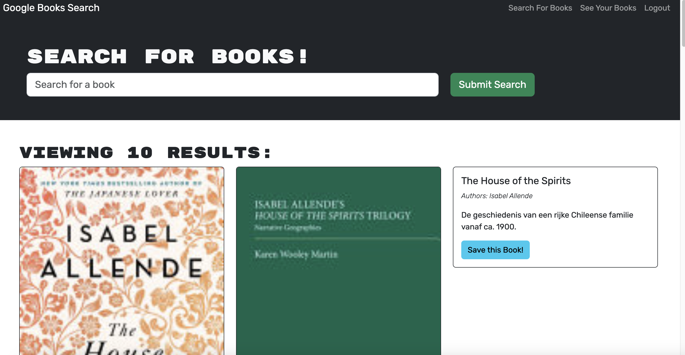

# Refactoring a Book Search Application to GraphQL API

## Table of Contents
- [Description](#description)

- [Installation](#installation)

- [Usage](#usage)

- [Contributing](#contributing)

- [License](#license)

- [Questions](#questions)

## Description

This purpose of this project was to refactor an existing application built with a RESTful API and instead implement a GraphQL API.  The application is a full stack website that allows users to create an account and search for books to save to their account.  Apollo Server was used alongside GraphQL to handle the request to the database.  Instead of creating multiple endpoints in the backend a typedef acted as a schema for what action to be performed and which data would be returned.  From there it was sent to the resolvers to make the actual request to the database depending on which query or mutation was requested.  The front- end uses React together with Apollo Client to make those GraphQL request for specific data.  Just like the backend, query and mutations were written so that specific data could be requested or created to the backend which was forwarded to the backend using Apollo Client.  Query and mutation hooks were used in the React logic to request data from the backend so that it can be used in the components.  In this application JSON Web Tokens were used for user verification.  The token is created each time a user logs in or creates a new account.  That token is then sent to the front- end so that if a request needs to be made to the database, the token will be sent back to the server so that it can keep track of the current user.  Adopting a GraphQL API makes this application much more efficient in that it queries the exact data that it needs by defining it in the schemas and it retrieves data in a single request which avoids unnecessary trips to the database.  The challenge of this whole project was getting accustomed to the syntax for GraphQL and the configuration for Apollo, however seeing how much cleaner and concise the code became makes GraphQL one of my favorite library that I’ve used.

## Installation

To install this project on your computer, fork this repository and clone it or download all the files from the repo.  Before moving forward, make sure to have Node installed in your environment to download all the packages that are necessary.  Once all the files are present, go to the terminal and run the command “npm install” to install all the packages needed for the app to run.  Since there will be some sensitive data that will be used for the tokens, create a .env to save that information in there.

## Usage

Once the installation is complete, to run the program in development enter the command “npm run develop” to render the React application.  Since there are two servers running, one for Vite and one for GraphQL, you can access the GraphQL playground to test backend request by going to that same localhost link for your front- end and at the end of it  add the endpoint “/graphql”.  In production ensure that you bundle the code by running the command “npm run build” and create a database on MongoDB Atlas. 
### Screenshot

## License

This repository is covered under the MIT license

## Questions

* GitHub Profile: [EzekielCampos](https://github.com/EzekielCampos)

If you have any additional questions contact me by email at ezcampos603@gmail.com

